# Cloud Fleet Routing

## Contents

- [Overview](#overview)
  - [Quick tour](#quick-tour)
    - [Get an initial solution](#get-an-initial-solution)
    - [Make some adjustments](#make-some-adjustments)
    - [Using metadata](#using-metadata)
    - [Understanding the solver](#understanding-the-solver)
  - [Concepts](#concepts)
    - [Overall system and workflow](#overall-system-and-workflow)
    - [Terminology](#terminology)
- [Application components](#application-components)
- [How To Guides](#how-to-guides)
  - [Planning routes and visits](#planning-routes-and-visits)
  - [Saving a solution](#save-a-solution)
  - [Starting from an empty scenario](#starting-from-an-empty-scenario)
- [Frequently Asked Questions (FAQ)](#frequently-asked-questions)
- [Advanced topics](#advanced-topics)
  - [Load scenarios from another system](#load-scenarios-from-another-system)

## Overview

[back](#contents)

Cloud Fleet Routing is an end-user web application that planners on transportation or logistics team can use to plan pickups and deliveries to locations using a fleet of vehicles.


Behind the scenes, Cloud Fleet Routing uses a powerful service from Google called the Fleet Routing API. Cloud Fleet Routing makes it easy for a Planner to do their daily work without having to know the details of how the Fleet Routing API works.

Cloud Fleet Routing lets users:

- Plan fleeting routing [scenarios](#scenario) from a fresh start.
- Load pre-defined fleet routing scenarios from a local file or from a corporate [transportation management system](#tms).
- Generate a plan or [solution](#solution) to a scenario by calling the Fleet Routing API behind the scenes.
- Make manual adjustments to the scenario or the solution, such as moving a shipment from one vehicle to another, or changing the time window of a pick-up.
- Save the resulting plan (solution) to the TMS so that vehicles can be dispatched.

### Quick tour

[back](#contents)

Learn the basics of using Cloud Fleet Routing by getting a [solution](#solution) to a [vehicle routing problem](#vrp).

#### Get an initial solution

1. <a href="sample-scenario.json" target="_none">Download the sample scenario</a>. If your browser opens this in a new tab, do _Save As_ to save to your computer in a location you will remember.

2. Click _Cloud Optimization AI_ in the top-left corner of the web page to get to the starting page.

3. _Upload existing scenario_ and browse to where you save the `sample-scenario.json` file from Step 1 then click _OK_.

4. Let's find a solution for all of the Shipments and allow the solver to consider all Vehicles.

   1. Select the _Planning Scenario > Shipments_ item on the left hand side of the page.
   2. In the Shipment Click the checkbox in the top row of the Shipments table to include all shipments.

      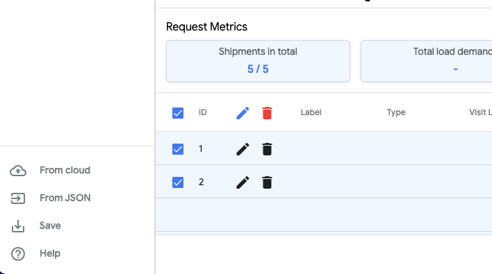

   3. Click on _Vehicles_ and select them all by clicking on the checkbox in the top row. Now that you have at least one Shipment and at least one Vehicle selected, the _GENERATE_ button is available.

5. Click _Generate_.

   1. You will briefly see a _Cancel_ button. If this were a more complex scenario you would have time to click it.

   2. Cloud Fleet Routing just submitted this small scenario representing a vehicle routing problem to Google's Fleet Routing API. It got a solution to the problem. The application switched to the Gantt view.

      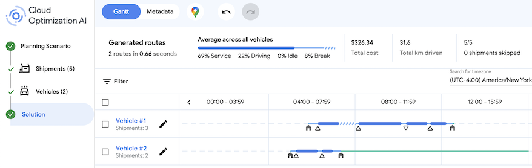

6. Click on the _Toggle map_ tool to show a map of the solution proposed by the Fleet Routing API. You can see a map of central Paris with the planned vehicle route. There's an icon showing the Depot, and little triangular icons showing pickup locations.

   1. Pickups are shown as triangle pointing up, whereas drop-offs look like a downward-pointing triangle.
   2. The icons on the map are the same as the icons on the Gantt chart.

7. Click on one of the shipments on the map.

   1. This reveals the Visit popup. You can see the related Shipment and the Vehicle that will be making the visit.

      

   2. **TIP:** Shipments are pickups or deliveries. The act of making a pickup or a delivery in the Fleet Routing API is called a **visit**. So if you see _Visit_ in Cloud Fleet Routing, just know that it's a specific vehicle making a stop at a location to pickup or drop something off.

8. Click the small link on the popup window for the Visit to open the Shipment for this visit to open the _Shipment Detail_. There's a lot on this screen but for now let's change the label from a simple number to something more helpful.

     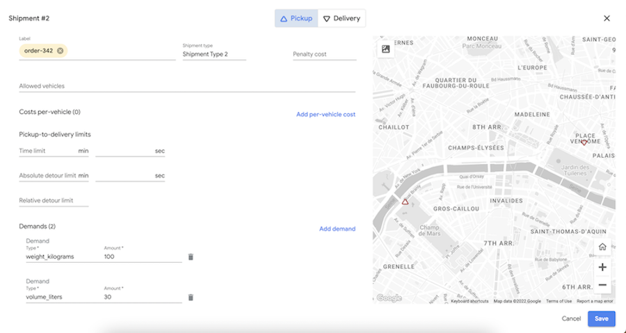

9. Click on the _Label_ field and type a short label, e.g., `order-123`.

   1. TIP: Pressing the `Tab` key on your keyboard or clicking outside the field will turn that text into a label. You can also type a comma `,` to add another label.

10. Press the _Save_ button on that _Shipment Detail_ page.

    1. You can see that your map popup now shows a meaningful label.

#### Make some adjustments

Having a plan is great, but what if you have new information and want to get a fresh solution from the Google Fleet Management API? Cloud Fleet Routing has you covered. Let's make some changes:

1. Open _Planning Scenario > Shipments_ to see the current VRP definition.
   1. Notice that Shipment #2 has both a pickup and a delivery. In the app a pickup and delivery are treated as a combination.

      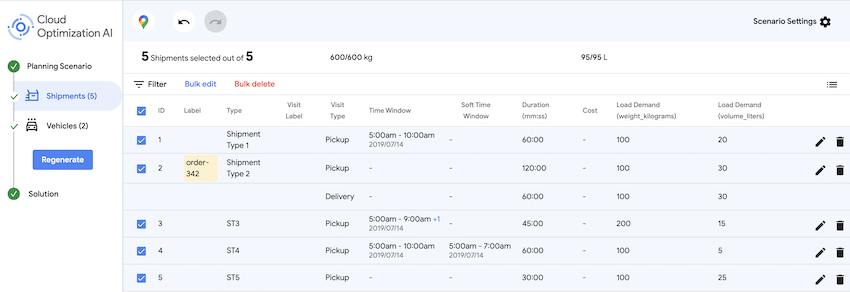

2. Click the _Edit_ icon (little pencil) on the row for Shipment #2 to open the _Shipment Detail_ view. Now that we're looking at the Pickup part of the shipment, we notice a few missing elements that we know should be changed.
   1. Notice that it's possible to provide more than one set of constraints (time windows, penalties) for a single pickup or delivery. Those are called visit request alternatives. But for now, we'll just update the one that has been provided.
   2. Update the `Time window` (also called the 'hard time window') for 7:00-8:30AM on July 4th, 2019. This is the time window within which the shipment **must* be picked up, otherwise the Fleet Routing API solver will consider it a missed shipment.
   3. Update the `Soft time window` to _start_ at 8:00AM on the same date. This indicates that the Fleet Routing API should **try** to get that shipment picked up after 8:00AM. That's different than the (hard) time window, which **must** be picked up during the 7:00-8:30AM window.
   4. You can also tell the solver that there is a penalty for not hitting the soft time window. Change the `Earliness penalty` to `2 / hour`. The units are value-less, but you might assume that this means _"2 euros penalty for each hour that the shipment is picked up early"_. Why Euros? Because it's in Paris, France!

      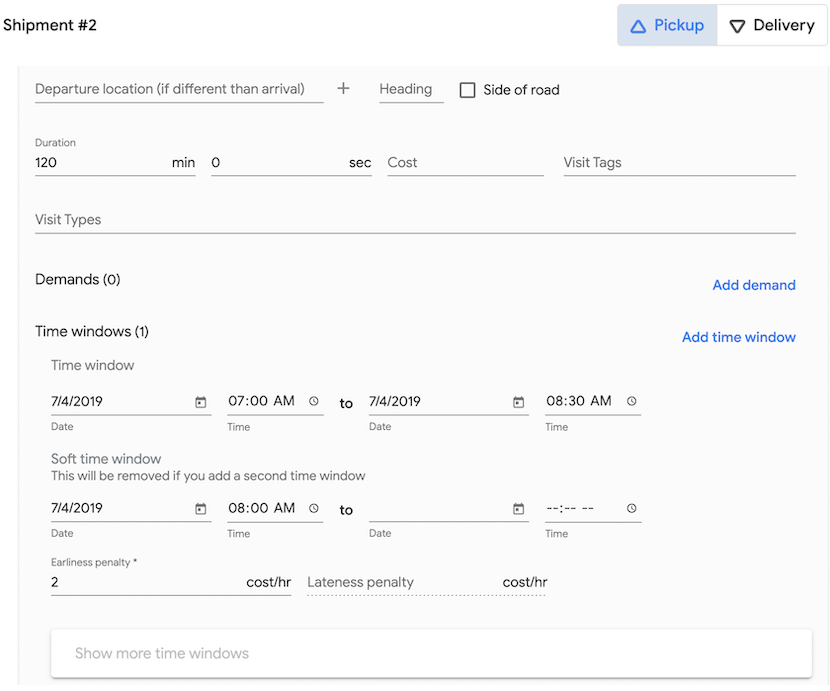

   5. Finally, we'll switch to the delivery part of this shipment by clicking the _Delivery_ icon at the top of the _Shipment Detail_ form.
   6. Change _Penalty cost_ to `30.00`. This means that the penalty for missing this delivery altogether is 30.00 (following the previous statement about units, we can assume this is 30 Euros, but we don't specify the units).

      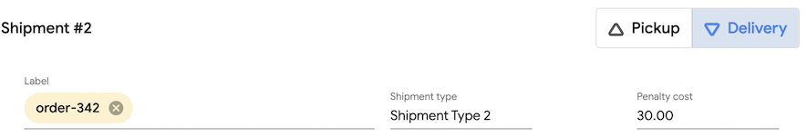

   7. Click the _Save_ button to see the updated information in the Shipment list view.
3. You have updated your Shipment. The action button changes from _Generate_ (first time) to _Regenerate_. Click the _Regenerate_ button.
   1. Oh no! We have a problem. One of the dates or times cannot be accommodated due to a global setting.

      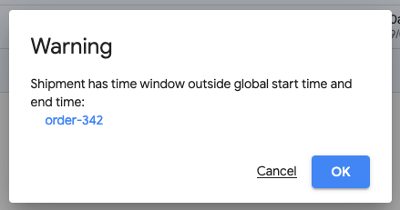

4. Click on the _Scenario settings_ button on the top right of the application window.

   1. There are plenty of settings to adjust here. Go to _Shipment Model_ tab. Notice that the _Routes begin at_  _Start Date_ field is July 14, 2019? Compare that with the _Time Window_ column in the _Shipment List_ table: we accidentally entered a shipment date of July 4th. That violates the global time window. We need to either adjust the global time window or adjust the shipment.

      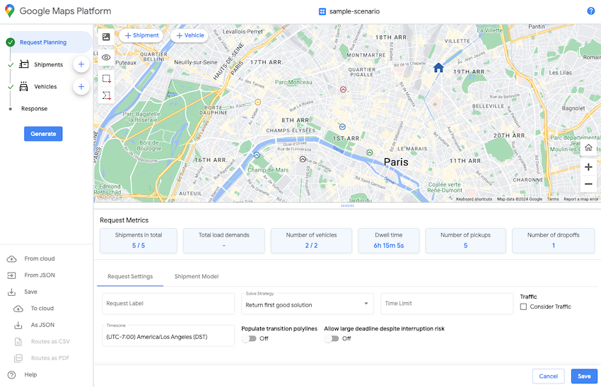
      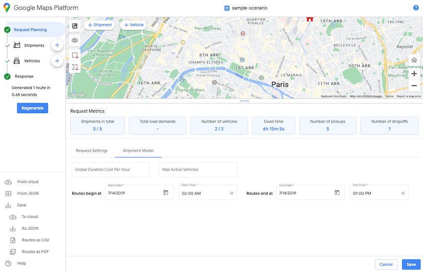

   2. Reopen the _Shipment Detail_ view for that shipment, adjust the date to July 14th, 20219 on the Pickup screen.

   3. Click the _Save_ button.

5. With our errors fixed, click the _Regenerate_ button again.

#### Using metadata

[back](#contents)

Looks good...until you see in the key performance indicator (KPI) summary that a shipment was skipped. We'll use the metadata view to figure out what's happened.

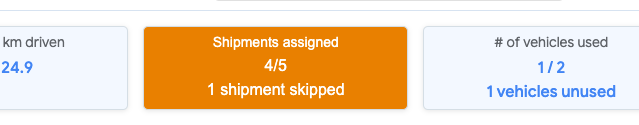

1. Switch to the _Metadata_ view then choose _Metrics per shipment_ to see the complete list of shipments.

   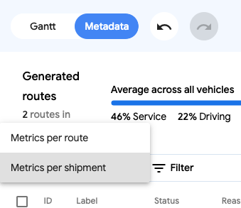

2. Sure enough, Shipment #2 was skipped.

   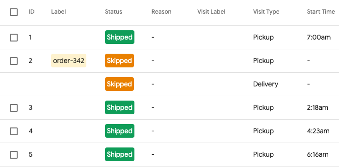

#### Understanding the solver

[back](#contents)

Cloud Fleet Routing uses the Fleet Routing API, which is a solver for vehicle routing problems. The solver can make all kinds of optimizations to accommodate a wide variety constraints and demands, including setting penalty costs on shipments or fixed costs on vehicles.

Looking at the brief description of [Skipped Shipments](#skipped), we would hope to see a helpful _Skipped Shipment Reason_ in the _Metadata View_.
However, while there are some obvious reasons for one or more shipments to be skipped, the complexity of input scenarios can be very high, and that leads to shipments being skipped for reasons that may not be easy to reason about.
The Fleet Routing API solver will not provide a _Skipped Shipment Reason_ unless it can be very explicit about the reason.
That means the reasons you see in the _Metadata View_ are quite actionable, but when no reasons is given for a skipped shipment it can be hard to know where to start.

> TIP: The Google team recommends a simple and iterative approach to handling skipped shipments. Iterative adjustments! Because the Fleet Routing API is relatively fast to generate solutions, you can tweak a value using the Shipment or Vehicle detail views, or the Scenario settings, and _Generate_ a new solution. For example, if a Shipment is skipped and you see that it has a very low _Penalty cost_, try looking at the average cost of reach vehicle route in the solution, and _at least_ making the penalty for that shipment higher than the average route cost. That will provide a strong hint to the solver that it is really expensive to skip that shipment.

Feel free to tweak, remove, or add additional parameters, shipment, and vehicles to get a sense for how the solver behind the Fleet Routing API works.

### Saving your work

Use the _Download_ button to save the solution to your local computer.
You can open the result text file to see exactly what Cloud Fleet Routing is sending to the Fleet Routing API.

## Application components

[back](#contents)

The main parts of the application are described here.
This is not exhaustive, and screenshots might look a little different from the version in your browser as the application evolves.

### Home screen

The home screen gives you three choices when you first open the application.

- Upload an existing scenario or solution. You have a JSON file that contains a VRP scenario you want to solve.
- Upload from CSV.
- Open a saved scenario or solution. The application is integrated with your [TMS](#tms) and you want to open a file exported from the TMS, or saved ready for use by the TMS.
- Build a new scenario. Start from an empty [scenario](#scenario) and add [shipments](#shipments) and [vehicles](#vehicle) manually.

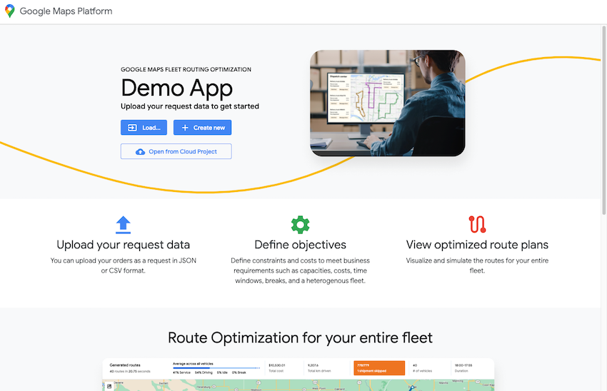

### App actions

Application actions work with scenario and solution files.
_Download_ and _Upload_ work with local files from your computer, whereas _Open_ and _Save_ work with files that will integrated with the [TMS](#tms).

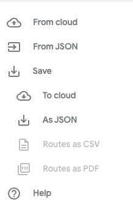
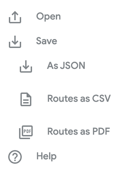

### Sidebar

The sidebar gives you a quick overview of the number of shipments and vehicles and uses gray (in progress), green (completed), and orange (warning) colors to indicate where you are in the application workflow.
Possible solution actions are shown as buttons, like _Generate_.

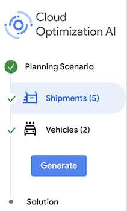

### Scenario settings

Scenario settings contains personal application settings like the local time zone.
All times in the application are stored as Coordinated Universal Time ([UTC](https://www.timeanddate.com/time/aboututc.html)).
Changing the time zone just adjusts how it is displayed in the application; it **does not change the underlying times**.

Most other Scenario Settings affect how the Fleet Routing API solver will act on a given input [VRP](#vrp) scenario.


### Toolbar

The toolbar switches between the major Solution views in the application: the Gantt or 'timeline' view and the Metadata or 'report' view.
The map tool toggles the visibility of the Google Map showing routes and shipments.
The Undo and Redo buttons enable you to back out of changes or reapply them.

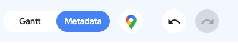

### Shipment and vehicle planning views

Whether you create them or load them from an existing file, the Shipment Planning View (and related Vehicle Planning View) give you a list of items in the scenario and a way to select which items will be sent to the solver.
Clicking on the checkbox next to the _ID_ column will select or unselect **all** items.
Use the Undo button if you make a mistake.
Filters can be applied, and the list can be sorted by clicking on any column heading.
Bulk Edit to edit multiple Shipments or Vehicles in one go.
Choose which columns are visible using the column picker.
Click on the pencil icon to edit any fields in the shipment or vehicle.

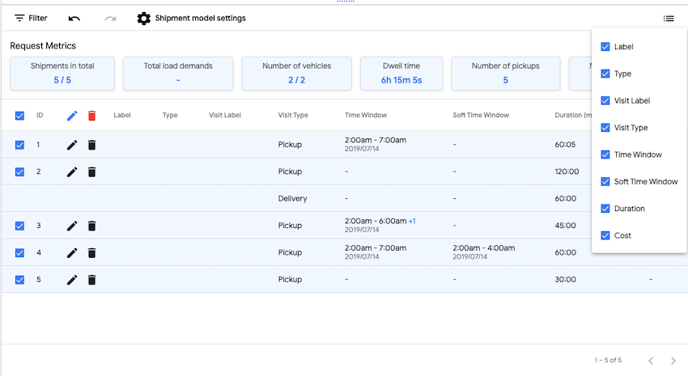

### Add Item button

The _Add Item_ button is visible on the bottom right of the Shipment and Vehicle planning list views.
It's a large plus sign button floating in the lower-right corner.
Clicking on the Add Item button will create a new empty Vehicle or Shipment, depending on which list is currently displayed.

### Shipment edit view

> NOTE: Not all of the capabilities or data supported by the Fleet Routing API are available in this form.

Clicking the pencil icon on any Shipment Planning List row opens the Shipment Edit View form.
A Shipment has minimal required information: a single pickup or drop-off [request alternative](#pra) with a location defined.
Everything is optional, but in almost all cases you will want to define [demands](#demands), and likely also time windows and fixed costs and penalties.

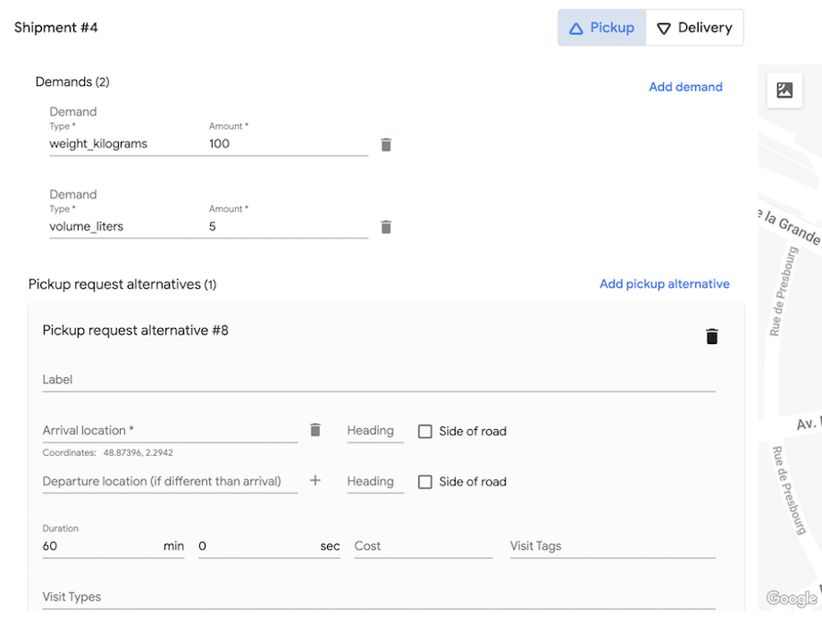

Once a solution has been built, an abbreviated version of the form is available, called the Shipment Quick Edit view.
The primary purpose of the Quick Edit is to tie a shipment to a subset of vehicles, or to change the pickup or drop-off time window.
The Quick Edit form replicates the actions performed by dragging-and-dropping a shipment on the Gantt View.

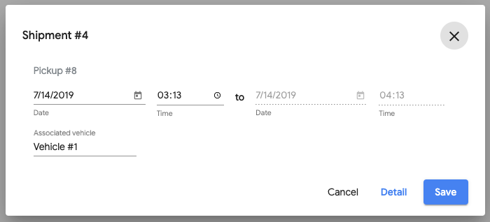

### Vehicle edit view

> NOTE: Not all of the capabilities or data supported by the Fleet Routing API are available in this form.

Clicking the pencil icon on any Vehicle Planning List row opens the Vehicle Edit view form.
There are zero required fields for Vehicles.
So you can just click the [Add Item](#add-item-button) and press _Save_ on the the Vehicle Edit View and get a perfectly valid vehicle.
Now typically, there will be a lot more going on: a start and end location; a start and end time; vehicle Capacities (Load Limits) that match [shipment demands](#demands), etc.

If you are adding a new Vehicle in this way, we recommend at least adding a label so that you can differentiate vehicles in the list view.

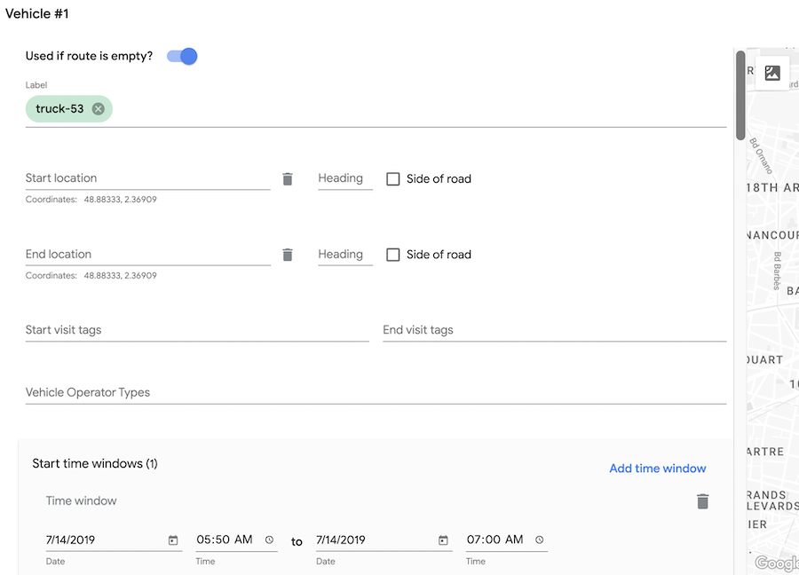

[back](#contents)

### Gantt View

Once a solution has been generated, the default view is the Gantt view.
Gantt charts show time windows and dependencies between tasks.
In Cloud Fleet Routing, each row in the chart is one route and it's associated visits.
Pickups are shown using a triangle pointing up; drop-offs use a downwards-point triangle.
If you drag a pickup and it has a related drop-off, you will see both move.
The same is true if you drag a drop-off: the pickup will move.

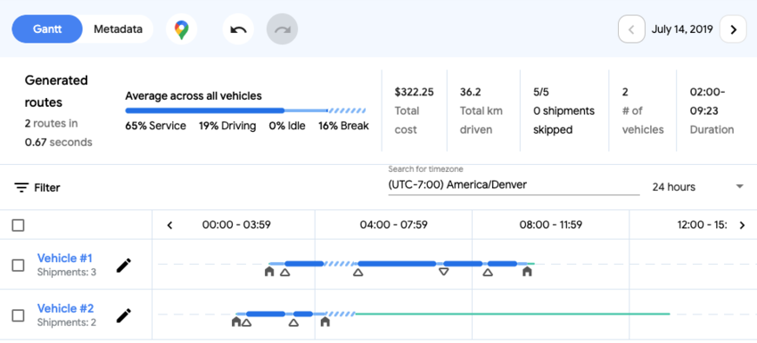

While on the Gantt view you can:

- Click on the pencil icon on any row to open the [vehicle edit view](#vehicle-edit-view) for that route.
- Click on the name of the vehicle servicing a route to open the Metadata View filtered to just that route.
- Apply filters to reduce the number of routes you see
- Drag and drop any visit along the timeline for the current route or drag to a different route entirely.
  > TIP: Use filters to reduce the number of routes on the Gantt view before dragging-and-dropping
- Click the `<` and `>` icons on the timeline heading to slide backwards and forwards in time.
- Zoom in and out on time slices using the time slice dropdown.
  For example, choose _24 hours_ to see an entire day or _1 hour_ to fine tune a solution.`
- Quickly switch time zones. Remember that this does not change the underlying data; it helps you communicate local time zones to your team.

### Map View

Clicking the _Toggle Map_ button in the [toolbar](#toolbar) will show and hide the Map.
This is a Google map that can optionally use your estimated location to center the map in a helpful spot.
The map has several useful tools.

- Select routes. Select one or more individual routes.
- Toggle selected. Switches between displaying all routes and shipments, or just the selected routes and associated shipments.
- Satellite view. This is particularly handy when trying to find a precise location for a shipment pickup or drop-off. Enable Satellite view to find exactly where the vehicle must be.

Clicking on a single visit provides shortcuts to associated shipment and vehicle, plus some brief summary information.


### Metadata View

The Metadata View lets you focus on the solution and drill down to specific routes and visits so you can understand and tweak them if needed.
Use the _Metrics per route_ and _Metrics per shipment_ dropdown to toggle between Route (vehicle) and Visit (shipment) summaries.
Filters are very capable to help focus on a subset.
You can edit an existing filters by click on them.

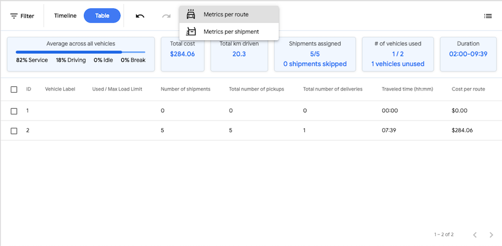

The _Skipped Shipment_ button is a quick way to access the Metadata View with the appropriate filter already in place.
The button will be highlighted in orange if your solution has skipped shipments.

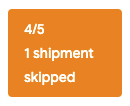

Any skipped shipments will have similar highlighting:


### Warnings and messages

Warnings are presented in the app whenever it can detect that you have a potential cause for error or confusion, or are taking an action that might result in a suboptimal solution.
For example, if you set the start or end time for a single shipment outside of the global time window defined in _Global Settings_ you will see this:


Similar messages will show up on edit forms, e.g., if you define a Load Demand in a Shipment, but no Vehicles have a related Load Limit (capacity) you will see a hint.

### Getting Started

The basic process in Cloud Fleet Routing is to either _Open_ or _Upload_ a scenario; _Generate_ a solution; optionally adjust the parameters of the problem; then either _Save_ or _Download_ the solution.

[back](#contents)

Unless your organization has set up Cloud Fleet Routing differently, you will need the following before you can:

- A Google account. This will almost certainly **not** be a personal GMail account but rather a Google Workplace account or Google Cloud Identity associated with your organizational email address.
- A desktop web browser. Cloud Fleet Routing is not designed to work on a mobile web browser. It may work, but will be difficult to use because it has a complex user interface that assumes at least a laptop-size screen.

If your organization has set things up differently, then follow the instructions provided. For example, you may be asked to use single sign-on with your existing corporate login rather than a Google account.

### Planning routes and visits

[back](#contents)

1. Open the application.
2. Click on the _Open saved scenario or solution_
3. Find then select one Scenario from the _Open_ dialog. Click _Open_.
4. Select one or more Shipments in the _Planning Scenario > Shipments_ window.
5. Select one or more Vehicles in the _Planning Scenario > Vehicles window.
6. Click _Generate_
7. Make any adjustments and iteratively use the _Planning Scenario > Regenerate_ function.

### Save a solution

[back](#contents)

Once you have [planned a scenario](#planning-routes-and-visits) or [started from scratch](#starting-from-an-empty-scenario) you want to pass the work on to the [TMS](#tms) for scheduling, or save the file for further use.

1. **Either** click _Save_ and follow the instructions in the dialog,
2. **or** click _Download_ to store the scenario and solution on your local machine.

If you _Download_ a file you can subsequently _Upload_ it back into Cloud Fleet Routing. It's a handy way to experiment with scenarios.

> TIP: If you save any file that you _Download_ with the file extension `*.json`, as in `my-scenario.json`, then you can open it in a web browser or text editor to see what data the Fleet Routing API actually uses. Developers can look at [the documentation](https://cloud.google.com/optimization) (password protected) to learn more.

### Starting from an empty scenario

[back](#contents)

1. Open the application
1. Click on the _Build a new scenario_ button. This opens the _Planning Scenario_ > _Shipments_ view.
1. Click on the _Add shipment_ button in the lower right corner of the app window.
1. Shipments must have at least one pickup or drop-off. Choose the _Pickup_ or _Delivery_ screen using the toggle button in the top-center of the _Shipment Detail_ window.
1. A pickup or delivery **must** have at least one [_Pickup request alternative_](#pra). Click _Add pickup request alternative_ and enter the required data.
1. Click on the _Planning Scenario > Vehicles_ view in the sidebar.
1. Click on the _Add vehicle_ button in the lower right corner of the app window.
1. Everything in the _Vehicle Detail_ is optional. You can just click _Save_ to continue.
1. Use the checkboxes next to vehicles and shipments to include them in the scenario.
1. Click _Generate_ to solve the VRP.

## Concepts

[back](#contents)

### Overall system and workflow

Cloud Fleet Routing can be used in a standalone mode: just use the _Upload_ and _Download_ tools to work with solution and scenario files on your computer.
But it is designed to be part of a bigger overall fleet dispatching system with both: an upstream system supplying the word to be done, which we term [vehicle routing problems](#vrp) or [scenarios](#scenarios); and a downstream system that accepts the [solutions](#solution) that Cloud Fleet Routing user has generated.

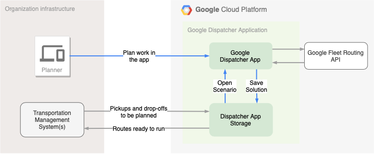

From a Planner's perspective, Cloud Fleet Routing is just a web application that understands how to find work to be planned in the corporate TMS via the _Open_ tool, and to be saved back to the corporate TMS using the _Save_ tool.

Behind the scenes there is a little more going on.
The corporate TMS is actually pushing work to be planned _from_ the TMS and _into_ Cloud Fleet Routing Storage component.
And when the Planner hits the _Save_ button, the solution (or routes ready to be run in the real world) are pushed back to that TMS behind the scenes via Cloud Fleet Routing Storage component.

The separate-but-related nature of Cloud Fleet Routing and the underlying data store for the vehicle routing problems to be solved ensures that each organization using Cloud Fleet Routing can integrate with whatever core business system they need to.

But as a Planner using Cloud Fleet Routing, just focus on _Open_ing work, planning it using the App, then _Save_-ing it back so drivers can start their routes.

### Terminology

The [API documentation][devsite] contains much more detail these and additional terms.

- <a name="vrp"></a>**Vehicle routing problem (VRP).** Given a set vehicles and locations, a solution to a VRP finds the optimal routes so that each location is visited by a vehicle.
- <a name="shipment"></a>**Shipment.** A shipment is either a pickup or a delivery (or both) that must be performed by a vehicle at a location. In addition to vehicles, shipments are the primary input to a VRP that Cloud Fleet Routing handles. Shipments must have at least one potential pickup or delivery window. Shipments may also have Load Demand(capacities) stated in the same units as the capacities of vehicles. For example, if a shipment has a weight of 200 kilograms, that is how much _Load Demand (capacity)_ that shipment will _demand_ of a single vehicle.
- <a name="vehicle"></a>**Vehicle.** A vehicle performs pickups or dropoffs of shipments. Vehicles have properties called Load Limits (capacities) that are used by Cloud Fleet Routing to find the optimal vehicle to perfrom a pickup or dropoff. For example, a vehicle might have a Load Limit (capacity) of '2 pallets' or '20 cubic meters'. Vehicles may also have a starting and ending location, and various time constraints. The visits that make up a Shipment
- <a name="scenario"></a>**Scenario.** A scenario is a vehicle routing problem (VRP) logistics problem that Cloud Fleet Routing can solve. It consists of one or more vehicles and one or more shipments.
- <a name="solution"></a>**Solution.** A solution is what the Fleet Routing API produces in response to a request to solve a [scenario](#scenario). Solutions are visible in Cloud Fleet Routing via the Gantt chart, on a map, or in the Metadata view.
- <a name="tms"></a>**Transportation management system (TMS).** A TMS is a generic term for the system or systems that an organization uses to generate a [scenario](#scenario) for the planners using Cloud Fleet Routing to solve. TMSs typically contain order information that becomes a [shipment](#shipment), and information about the fleet of vehicles that will be used to deliver or pick up those shipments.
- <a name="stw"></a>**Soft time window.** Sometimes there is flexibility when a shipment needs to be picked up or dropped off. For example, a customer may say that they **must** have a delivery.
- <a name="skipped"></a>**Skipped shipment.** The Fleet Routing API solver optimizes for minimum cost while considering a list of constraints. Given those inputs, it is possible or even likely that the solver cannot find a solution that has every shipment being picked up or deliver. Sometimes the reason that the solver has skipped a shipment is very clear. In those cases the _Metadata_ view will list that reason. The full list of Reason Codes are in the [developer documentation](https://cloud.google.com/optimization/docs/reference/rpc/google.cloud.optimization.v1#google.cloud.optimization.v1.SkippedShipment.Reason.Code) (may be behind a login) but `DEMAND_EXCEEDS_VEHICLE_CAPACITY` is a representative example.
- <a name="pra"></a>**Pickup request alternative.** It is common for a shipment pickup or shipment delivery to support more than one possible pickup or delivery alternative. For example, a package delivery company may have offered two potential delivery windows for a customer. The _Pickup/Delivery Request Alternative_ is how that is modeled in the app.
- <a name="demand"></a>**Load Demand.** A load demand is what a vehicle will be delivering or picking up to satisfy a [shipment](#shipment).
  For example, a load demand might be _'One pallet'_ or _'200 kilograms'_ or _'15 refrigerated cases'_. A load demand must have a type ('weight') and an amount ('2') and optionally units ('kilograms').
  Load Demand types and amounts match up with similarly defined Load Limits (capacities) of vehicles.
  Matching one or more shipment load demands with one or more vehicle capacities is a key capability of the Fleet Routing API solver.

[devsite]: https://cloud.google.com/optimization

## Frequently Asked Questions

[back](#contents)

**Q: What's the difference between a penalty cost of zero (0) and a penalty cost that is not defined (empty)?**

A: An _undefined_ penalty cost on a shipment is interepreted as an _infinite_ penalty cost. In the application UI this looks like an empty field:

   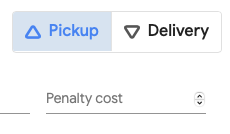

An infinite penalty cost will cause the solver to attempt to handle that shipment at--almost literally--any cost.

Conversely, a penalty cost field that has defined numeric value is interpreted as a specific penalty cost.
For example, if your assumed units of cost are Euros, then a penalty cost of `300` will be interpreted by the solver as: _'the cost of **not** handling this shipment is 300 Euros'_.

As a result, setting a specific penalty cost on one shipment but not others can likely cause a shipment to be skipped.

**Q: Why does Cloud Fleet Routing ask for access to my location?**

A: This is just a convenience. If you do grant access to Browser Location and you are [starting from an empty scenario](#starting-from-an-empty-scenario), the Google Map will automatically be centered on your approximate location. If you are working on an existing scenario, the map will use the locations of the shipments and vehicles instead.

If you do not grant location permission, the app will use a default location specified in the configuration. You cannot override this default location.

## Advanced Topics

[back](#contents)

### Load scenarios from another system

> NOTE: This is an advanced topic for IT and engineering staff. You will need to install the [`gcloud`](https://cloud.google.com/sdk/gcloud) command-line tool and understand how to work with Google Cloud resources.

The _Open_ dialog supports an end user opening a valid Fleet Routing API scenario. But how do they get into that list in the first place? The [application architecture diagram](#overall-system-and-workflow) explains the big picture for TMS-to-Cloud Fleet Routing integration. The _default_ integration approach that comes as part of Cloud Fleet Routing from Google Marketplace uses Google Cloud Storage. While most integrations will likely use something more elegant like the [Google Cloud client libraries](https://cloud.google.com/apis/docs/cloud-client-libraries) (like [the Go client library for Cloud Storage](https://pkg.go.dev/cloud.google.com/go/storage)), we can mimic the operation using a few commands.

#### Configure `gcloud`

We will use the convention `$PROJECT` as a placeholder for the name of the Google Cloud project where you deployed Cloud Fleet Routing.

1. Open the Google Cloud Console Service Accounts page. For example, https://console.cloud.google.com/iam-admin/serviceaccounts?project=$PROJECT.
2. Use the _Actions >... > Create key_ menu for the _Compute Engine default service account_ record.
3. Choose Key Type > JSON and save the resulting `*.json` file somewhere locally that you can find again, e.g., `my_account_key.json`.

#### Load Scenario

Now let's get a scenario loaded into Cloud Fleet Routing!

1. <a href="sample-scenario.json" target="_none">Download the sample scenario</a> and save it as `sample-scenario.json`.
2. Configure `gcloud` with access to the necessary Google Cloud resources in your project.

   ```bash
    gcloud config set project $PROJECTID
    gcloud auth activate-service-account --key-file=my_account_key.json
   ```

3. Find the GCS bucket that contains scenarios. The bucket name is something you will have configured when you deployed the app from the Google Marketplace, but it's good to validate before trying to copy files there:

   ```bash
    $ gsutil ls
    gs://some-bucket
    gs://dispatcher-solutions-dev/ # This is the one we want!
    gs://another-bucket
    ...
   ```

4. Use the `gsutil` tool to upload the sample scenario.

   > TIP: By default the application is configured to look for a folder called `scenarios` and a subfolder named after a date, e.g., `2020-01-31`.

   ```bash
    bucket=gs://dispatcher-solutions-dev
    path="scenarios/$(date +%Y-%m-%d)" # Get the right date-formatted destination
    destination="$bucket/$path/"
    gsutil cp sample-scenario.json $destination
    gsutil ls $bucket
   ```

5. Open Cloud Fleet Routing and use the _Open_ function, you should see something like `2021-01-28/sample-scenario.json` ready to work with.
