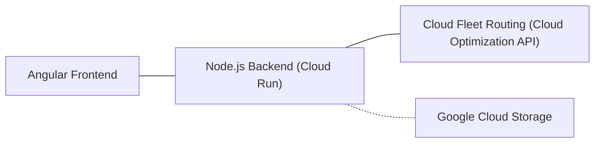
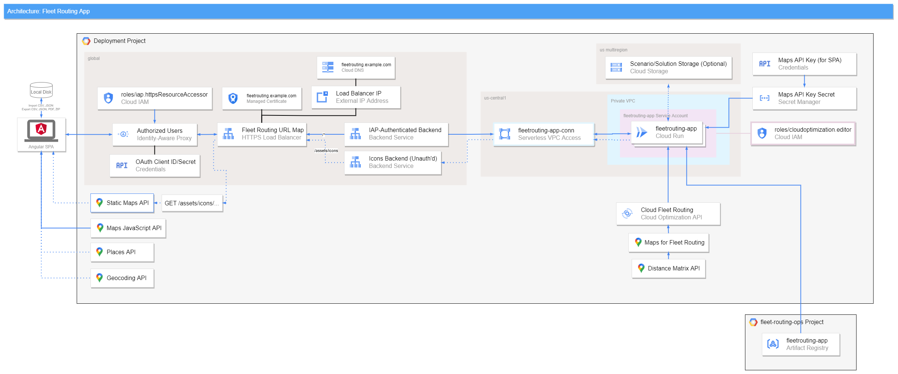

# Google Fleet Routing App - Architecture

The application consists of a **frontend** Angular single-page web application
and a Node.js **backend** API. The frontend app is served
as static files by the backend.

Requests to **Cloud Fleet Routing** are proxied from the frontend
through the backend. The backend forwards requests to the
**Google Cloud Optimization client library for Node.js** (pre-release build),
authenticated as the backend's dedicated service account.

Optionally, "scenario" and "solution" JSON files created in the app
can be saved to and loaded from a **Google Cloud Storage** (GCS) bucket.
This GCS integration must be explicitly enabled in the deployment configuration,
*it is not enabled by default*.

## Cloud Infrastructure

All resources are deployed to a single Google Cloud Platform (GCP) project.
By default, regional resources are deployed to the `us-central1` region
and multi-regional resources are deployed to the `us` multi-region.

### Cloud Run
The application is deployed as a container on **Cloud Run**.
Container images are pulled from an **Artifact Registry**
repository in the `fleetrouting-app-ops` project.

The Cloud Run service runs as a dedicated **Service Account** (`fleetrouting-app`)
with the *Cloud Optimization AI Editor* (`roles/cloudoptimization.editor`) IAM role.
The Cloud Run instances run on a **private VPC network** (i.e. not publicly-accessible).
*No default VPCs or service accounts are utilized*.

### Application Credentials
Use of **Identity-Aware Proxy** (IAP) requires an **OAuth Consent Screen**
and **OAuth Client ID/Secret** to be configured for the project.
The OAuth credential is provided at deploy time
as a Terraform [*sensitive* variable](https://learn.hashicorp.com/tutorials/terraform/sensitive-variables).

Client-side use of **Google Maps Platform** APIs in the frontend
requires an **API Key**. This API is stored in **Secret Manager**
and provided to the backend as an environment variable.
The key is then passed to the frontend via a configuration file.

### User Authorization
User access is managed with **Identity-Aware Proxy** (IAP).
Users are prompted to log in with their Google account,
and the **HTTPS Load Balancer** forwards all traffic
(except static map markers icons [see *Static Map Markers* section])
to the IAP-authenticated backend.

The IAP backend restricts access to users
with the *IAP-secured Web App User* (`roles/iap.httpsResourceAccessor`) IAM role.
The backend connects to the private Cloud Run service
via **Serverless VPC Access**.

#### Static Map Markers
An exception to the IAP authorization exists to support **Static Maps API**.
The frontend static content contains PNG images that are used as
customer marker icons in the static maps generated by the PDF export feature.
Static Maps API requires that these marker images must be publicly accessible.
Therefore requests to `/assets/icons/...` go to a separate,
unauthenticated backend. *This is the only public content,
all other paths require IAP authorization.*

### Domain & HTTPS
The load balancer is configured with an **external static IP address**
which is mapped to a custom domain name with **Cloud DNS**.
A **Google-managed certificate** for the domain supports HTTPS traffic.
Unencrypted HTTP traffic is redirected to HTTPS.

### Project APIs & Services
The application requires that the following APIs and services (and their dependencies)
are enabled for the project:

- Google Cloud Platform
  - Cloud Run
  - Identity-Aware Proxy
  - Secret Manager
  - Serverless VPC Access
  - Storage
- Optimization / Fleet Routing
  - Cloud Optimization API
  - Maps for Fleet Routing
- Google Maps Platform
  - Distance Matrix API
  - Geocoding API
  - Maps JavaScript API
  - Places API
  - Static Maps API

---
## Frontend
The frontend is an Angular single-page application (SPA).

- The user constructs a Cloud Fleet Routing vehicle routing *scenario*
  from scratch with the forms in the application
  or imports a JSON or CSV file populated with *scenario* data.
  - In the app forms, vehicle and shipment locations are specified
    with **Place Autocomplete**
  - JSON records containing waypoint locations as Place IDs
    are sent to **Place Details** to get lat/lng locations for mapping purposes.
  - CSV records containing addresses are sent to **Geocoding API** to get lat/lng
    locations for mapping purposes.
  - **Maps JavaScript API** displays location data in a **deck.gl** overlay:
    - Vehicle start/end locations
    - Shipment pickup/dropoff locations
- The *scenario* can exported to local disk as a JSON file
- When the user is ready, the app sends the *scenario* to **Cloud Fleet Routing**
  via the **backend**, which returns a *solution* containing the optimized routes
  - Any errors for the request are presented to the user
- With an active *solution*, users can explore the optimized routes
  - **Maps JavaScript API** displays the route paths in a **deck.gl** overlay
- The combined *scenario* and *solution* can be exported together
  as JSON files bundled into a ZIP archive
- Solved routes may be exported to local disk as CSV or PDF files.
  - PDF export uses **Static Maps API** to display route paths.
- If configured, users may save and load scenarios and solutions
  to/from **Google Cloud Storage** as JSON files.

---
## Backend
The backend service is a **Node.js Express API**, written in **TypeScript**.

- Serves the frontend app as static content
  - Injects environment-specific variables (URLs, Maps API key, feature flags)
    into the frontend's `config.json` file at runtime
- Proxies **Cloud Fleet Routing** requests, forwarding them to the
  **Google Cloud Optimization client library**
- If configured, writes and reads *scenario* and *solution* JSON files
  to/from Google Cloud Storage with the Google Cloud Storage client library
- Requests have 1-hour to allow for long-running optimization requests

---
## Dependencies
A non-exhaustive listing of key dependencies follows.

### Deployment
Requires **Google Cloud CLI**, **Terraform** and these providers:
- hashicorp/random
- hashicorp/time
- hashicorp/google
- hashicorp/google-beta

### Frontend
Runtime:
- Angular
- Deck.gl
- Google Maps JavaScript API
- Google Cloud Optimization client (pre-release)
- NgRx
- Turf

Development:
- ESLint
- Jasmine
- Karma
- Puppeteer
- Sass
- TypeScript

### Backend
Runtime:
- Express
- Google Cloud Optimization Client
  > The optimization client library is an pre-release build provided by Google.
  > It is not publicly distributed.
- Google Cloud Storage Client
- Pino

Development:
- Axios
- ESLint
- Jest
- Supertest
- Typescript

### Local development runner
Development:
- Lerna

---
## External APIs
The following external APIs are used by the app:

- Google Cloud Optimization API
- Google Fonts
- Google Maps Platform:
    - Geocoding API
    - Maps JavaScript API
    - Places API
    - Static Maps API
- Google Cloud Storage API
